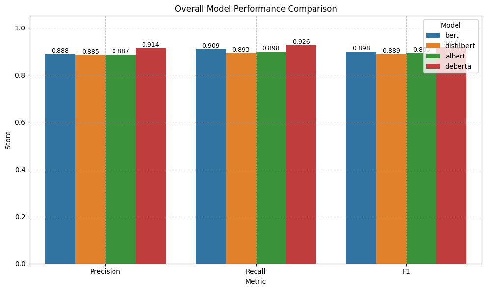
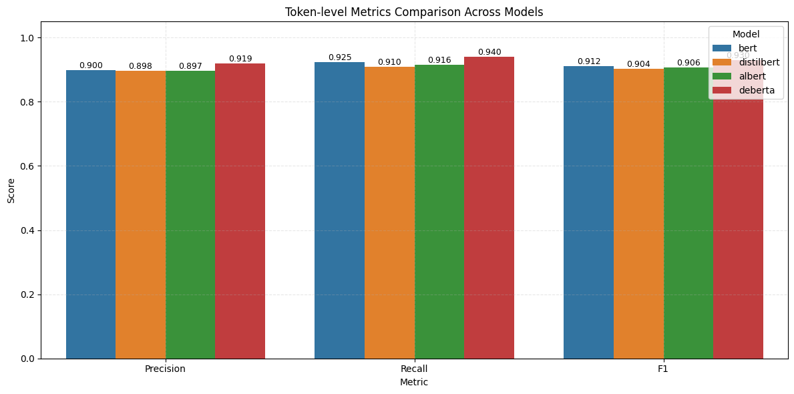
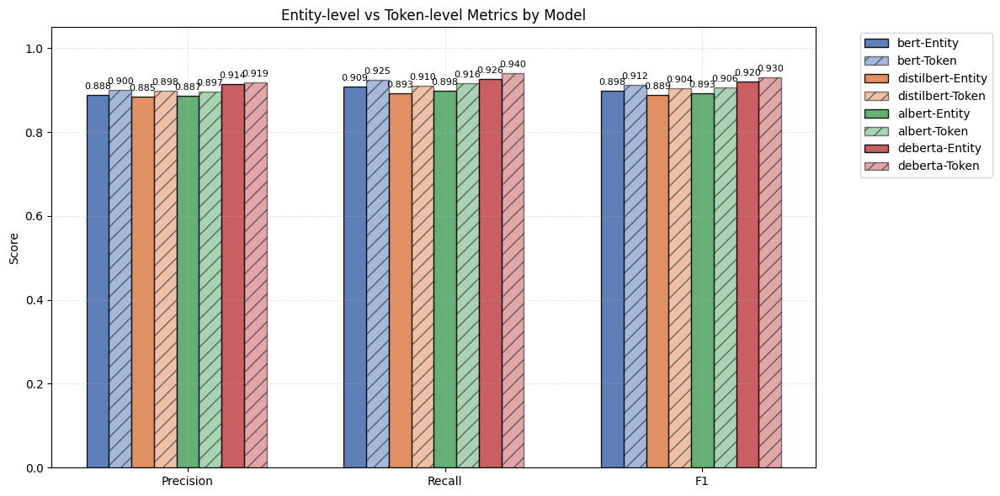
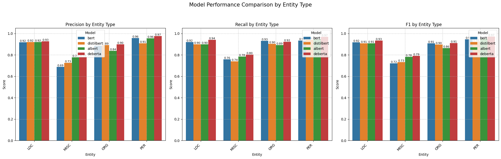
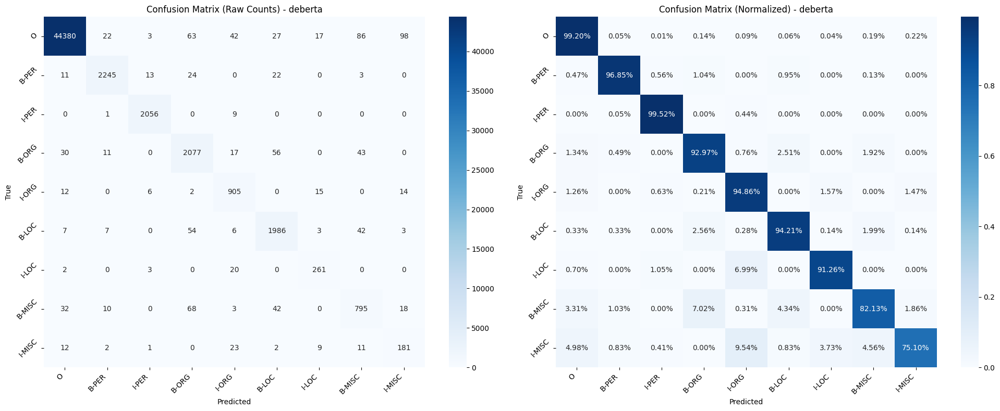
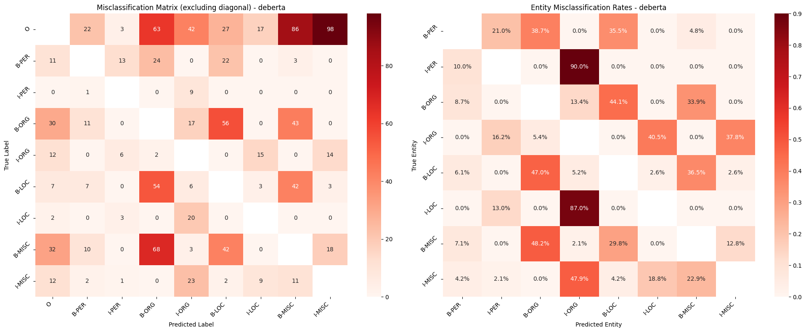
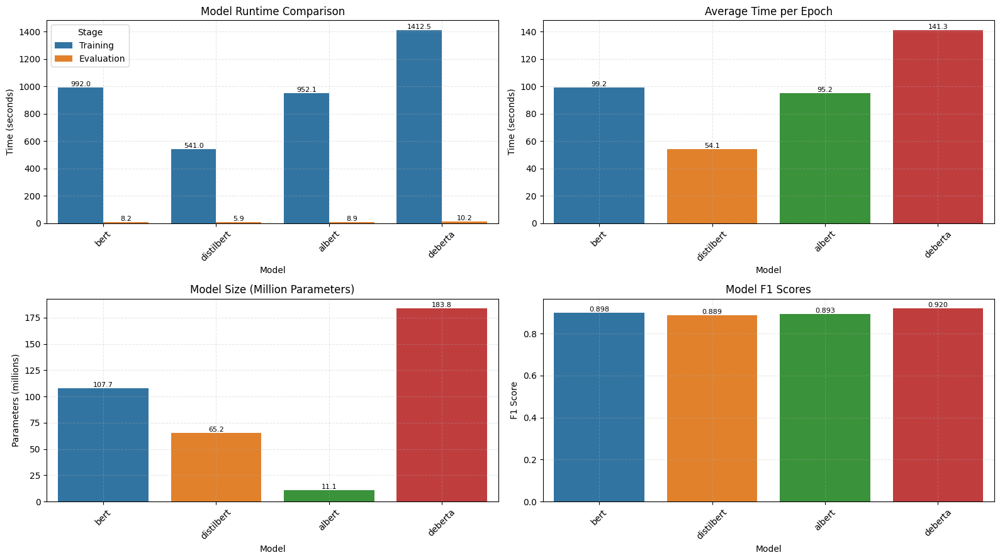

# **Comparative Analysis of Transformer-Based Models for Named Entity Recognition on CoNLL-2003**

# 1. Overview

Named Entity Recognition is a fundamental yet slightly outdated task in Natural Language Processing. In this study, I conducted a comparative analysis of multiple Transformer-based models, including BERT, DistilBERT, ALBERT, and DeBERTa, evaluating their effectiveness in NER using the CoNLL-2003 dataset. The primary focus was on model performance (Precision, Recall, F1-score) and efficiency (training time, parameter count, inference speed).

Additionally, I explored the possibility of using T5, a text-to-text model, for NER by converting the task as a sequence generation problem and transforming IOB-tagged sequences into structured entity descriptions. While this approach allows for greater flexibility, it comes with significant computational costs and increased complexity.

The results indicate that DeBERTa outperforms other models in terms of F1 score, while DistilBERT offers the best trade-off between efficiency and performance. However, MISC entity classification remains a major challenge, highlighting potential areas for improvement such as data augmentation, contrastive learning, and loss function modifications.

---

# 2. Experimental Setup and Methodology

## 2.1 Dataset Introduction
CoNLL-2003 dataset contains sentences tagged with four types of named entities: **PER**, **LOC**, **ORG**, and **MISC**. Each sentence is tokenized, and each token is annotated with a specific NER tag (e.g., B-PER, I-PER, O, etc.).

## 2.2 Data Preprocessing
1. **Loading and Splitting**  
Loaded the CoNLL-2003 dataset from the Hugging Face `datasets` library, which provides the training, validation, and test splits.
2. **Label Alignment**  
   Because subword tokenization can split a single word into multiple tokens, I align the original entity labels to these sub-tokens. Tokens that do not correspond to a new word get a special label index (`-100`) so that they do not contribute to the training loss.

## 2.3 Model Selection and Hyperparameter Setting
1. **Models**  
   - **BERT (bert-base-cased)**  
   - **DistilBERT (distilbert-base-cased)**  
   - **ALBERT (albert-base-v2)**  
   - **DeBERTa (microsoft/deberta-v3-base)**
2. **Hyperparameters**  
   - **Learning Rate**: Ranging from 2e-5 to 3e-5, depending on the model  
   - **Batch Size**: 16  
   - **Epochs**: 10 (with early stopping)  
   - **Weight Decay**: 0.01  
   - **Max Sequence Length**: 128 (for ALBERT and DeBERTa; default for others)

---

# 3. Results Analysis

## 3.1 Model Performance Comparison(Entity-level vs Token-level)

The bar chart below compares each model’s **Precision**, **Recall**, and **F1** at both the entity level (Entity-level) and the token level (Token-level):

- **DeBERTa** shows the best overall F1 (0.920), followed by BERT (0.898), ALBERT (0.893), and DistilBERT (0.889). The differences among the latter three models are minimal, but DeBERTa outperforms them by a significant 3 percentage points. This suggests that DeBERTa has a stronger ability to capture entity boundaries and contextual semantics, likely benefiting from its deeper attention mechanism and enhanced representation power.

- For all models, **token-level** metrics (precision, recall, F1) are slightly higher (1% - 2%) than **entity-level** metrics. This is expected because token-level evaluation focuses on individual token correctness, while entity-level evaluation requires the entire entity span to be correctly identified, making it a stricter metric. This is also why I chose entity-level precision, recall, and F1 as the primary evaluation metrics, as they better reflect the model’s real-world performance in entity recognition tasks.

## 3.2 Model Performance Comparison by Entity Type

#### **Overall Implications**
- **DeBERTa** remains the top performer across all entity types, confirming its superior capability in NER tasks.
- **MISC** classification remains a challenge, indicating the need for further improvements in handling ambiguous and underrepresented entity categories.
- **Potential improvements** could focus on augmenting MISC data, using contrastive learning, or employing loss function modifications to address class imbalance issues.

## 3.3 Confusion Matrix and Misclassification heatmap
Below are the confusion matrices and misclassification heatmap for DeBERTa. Since all models follow a similar confusion matrix pattern, I focus on DeBERTa, which has the best performance, for a detailed analysis.

### 3.3.1 Overall Performance & Diagonal Dominance
   - The **diagonal dominance** in the **normalized confusion matrix** indicates that DeBERTa performs well across all entity types. Most true labels are correctly predicted, with high classification accuracy for major categories.

### 3.3.2 Strong Performance on Common Entities
   - The best performance is **"I-PER" (99.52%)** and **"B-PER" (96.85%)**, followed by , **"I-ORG" (94.86%)**, **"B-ORG" (92.97%)**, **"B-LOC" (94.21%)**, and **"I-LOC" (91.26%)**. This indicates that DeBERTa is good at distinguishing named entities from non-entities in types like persons and organizations.

### 3.3.3 Challenging Entity Types
   - Overall, the worst-performing categories are **"I-MISC" (75.10%)** and **"B-MISC" (82.13%)**, likely due to the ambiguous nature of miscellaneous entities. These categories often contain entity types that are harder to define and may overlap with other categories, making classification more difficult.

### 3.3.4 Misclassification Patterns and Analysis
   - **B-MISC and I-MISC Misclassification**: **"B-MISC" is most frequently misclassified as "B-ORG", and "I-MISC" is most frequently misclassified as "I-ORG"**, indicating that the model struggles to distinguish between miscellaneous and organization entities. This suggests that some miscellaneous entities may share contextual or structural similarities with organizations, leading to misclassification, especially when entity boundaries are unclear.

   - **More Misclassifications into "B-" than "I-" (Except I-MISC)**: Across most categories, tokens are more likely to be misclassified as "B-" rather than "I-". This indicates that the model tends to incorrectly predict new entity beginnings rather than continuing an existing entity, suggesting entity boundary detection could be improved.

   - **I-LOC (91.3%) is the lowest among non-MISC categories, with 7% misclassified as I-ORG**: This could be due to **location names and organization names often sharing similar structures**, such as city names in company names (e.g., "New York Times" vs. "New York"). The model may struggle to distinguish whether a token is part of a location or an organization in ambiguous cases.

   - More attention can be paid to **misclassified classes, especially B-MISC and I-MISC**, as they exhibit the highest confusion with other entity types. This could potentially be improved by **modifying the loss function** to incorporate **class-specific weighting** (e.g., **focal loss** or **label smoothing**) to penalize frequent misclassifications more heavily. Techniques like **contrastive learning** or **data augmentation** could also help.

   - From the **class distribution**, we observe that **categories with higher sample counts tend to have better prediction accuracy**. The **MISC** entity class has a significantly lower proportion of examples compared to other named entity types, which is likely a key factor contributing to its lower performance. The model may struggle with **underrepresented classes** due to limited training data, leading to more misclassifications. Addressing this imbalance through **data augmentation or loss function adjustments** could help mitigate the issue.

| Label   | Count | Percentage (%)|
|---------|-------|---------------|
| O       | 44738 | 80.01         |
| B-PER   | 2318  | 4.15          |
| I-PER   | 2066  | 3.70          |
| B-ORG   | 2234  | 4.00          |
| I-ORG   | 954   | 1.71          |
| B-LOC   | 2108  | 3.77          |
| I-LOC   | 286   | 0.51          |
| B-MISC  | 968   | 1.73          |
| I-MISC  | 241   | 0.43          |

## 3.4 Model Efficiency Analysis
The table below compares runtime and resource usage across models:

| Model       | Total Runtime (sec) | Training Time (sec) | Evaluation Time (sec) | Actual Epochs | Avg Time per Epoch (sec) | Parameters (millions) | F1 Score |
|-------------|---------------------:|---------------------:|-----------------------:|--------------:|--------------------------:|-----------------------:|---------:|
| **bert**    | 1009.70             | 991.96              | 8.19                  | 10.0          | 99.20                    | 107.73                | 0.898    |
| **distilbert** | 554.50          | 541.04              | 5.95                  | 10.0          | 54.10                    | 65.20                 | 0.889    |
| **albert**  | 968.47              | 952.08              | 8.93                  | 10.0          | 95.21                    | 11.10                 | 0.893    |
| **deberta** | 1432.89             | 1412.55             | 10.16                 | 10.0          | 141.25                   | 183.84                | 0.920    |

### **Key Observations**:
- **DeBERTa** achieves the highest F1 (0.920) but at the cost of the largest parameter size (**183.84M**) and the longest runtime. This suggests that its **enhanced self-attention mechanisms and deeper architecture** contribute to its superior performance but require more computational resources.
- **DistilBERT** has the shortest overall runtime (**554.50 sec**) and fewer parameters (**65.20M**), making it the most efficient model. Despite being a **lighter model**, it maintains an F1 score (0.889) close to **BERT (0.898) and ALBERT (0.893)**, while requiring **only about half the runtime** of BERT. This makes it a strong candidate for **resource-constrained applications**.
- **ALBERT** has only **11.10M parameters**, yet its runtime (**968.47 sec**) is close to BERT (**1009.70 sec**), which is unusual. This could be due to increased communication overhead from its factorized embedding parameterization or additional computations required for cross-layer parameter sharing.
- **BERT** serves as a **balanced baseline model**, offering solid performance with **moderate runtime and parameter size**. It remains a good reference point for comparing trade-offs between efficiency and accuracy.

# 4. Text-to-Text Models: T5

## 4.1 Approach
To use T5 for this NER task, my method reformulates NER as a **text generation problem**. Instead of classifying tokens, I convert **IOB-tagged sequences into natural language descriptions**, transforming sentences like:

**Input:** `"John lives in New York"` → `"extract entities: John lives in New York"`  
**Output:** `"PER: John; LOC: New York"`

This trains T5 to generate structured entity outputs, allowing alignment with standard NER evaluation metrics through specialized post-processing.

## 4.2 Challenges and Limitations
- **Computationally Heavy:**  
  - T5-base requires **significantly more runtime** compared to BERT-based models.  
  - While **BERT/DeBERTa complete an epoch in 2-3 minutes**, T5-base takes **10× longer** (~2 hours for 4 epochs).
  
- **Code Complexity & Debugging Overhead:**  
  - Unlike BERT-style models where token classification is straightforward, **T5’s sequence-to-sequence formulation** introduces **additional complexity** in tokenization, decoding strategies, and output parsing.

- **Performance Gap**: 
  - Despite the increased computational cost, **T5-base achieves an F1 score of 0.891**, which is lower than DeBERTa (0.920) and only comparable to BERT (0.898), ALBERT (0.893), and DistilBERT (0.889).
  
## 4.3 Conclusion
- T5 provides a flexible text-to-text approach for NER, but at the cost of **significantly higher computation time** and **more complex implementation**.  
- Performance does not justify the increased cost, as traditional BERT-based models achieve similar or better F1 scores with much lower computational overhead.  

# 5. Summarize

- **DeBERTa outperforms other models** with the  3 percentage higher F1 score, but at the cost of higher computational resources. Given the overall run time and GPU cost, this is acceptable.
- **DistilBERT offers the best efficiency** with the shortest training time and reasonable preformance, making it ideal for resource-constrained scenarios.
- **T5** can do NER with a flexible text-to-text approach, but cost of **significantly higher computation time** and **more complex implementation**, not worth it.  
- The low performance on **MISC** data is most likely due to **data imbalance** and **non-efficient training**. Other possible reasons include high intra-class variance, overlapping features with ORG and LOC, and lack of contextual cues.
- **Potential improvements** including increasing the number of MISC-labeled examples through synthetic data generation or bootstrapping, **contrastive learning**, **loss function modifications** (**focal loss** or **label smoothing**).

# 6. Future Exploration
- Performing column-wise normalization on the confusion matrix to examine the purity of each predicted class and analyze the distribution of precision across different categories.
- Printing different types of misclassified samples for further analysis, identifying common error patterns and potential areas for improvement.
- Introducing external knowledge sources. 
- Implementing data augmentation for imbalanced classes.
- Finding out why ALBERT took as much time as BERT.
- Trying LLMs or Transformer+CRF models.

