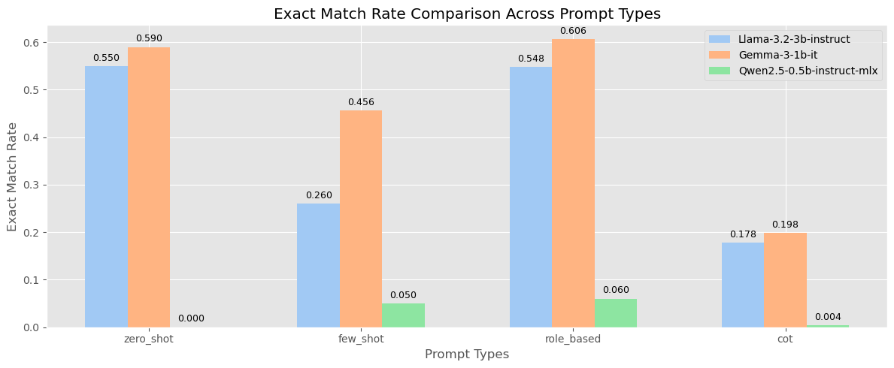
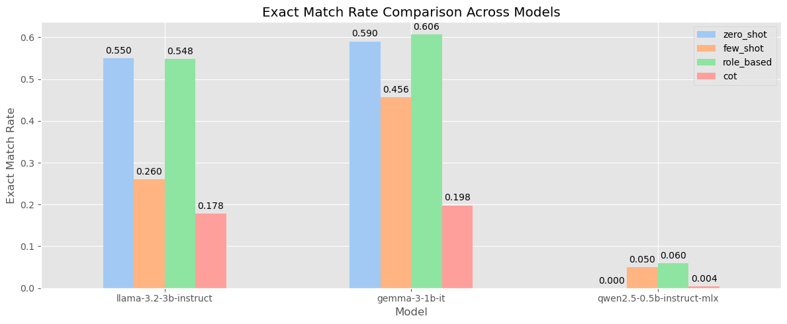
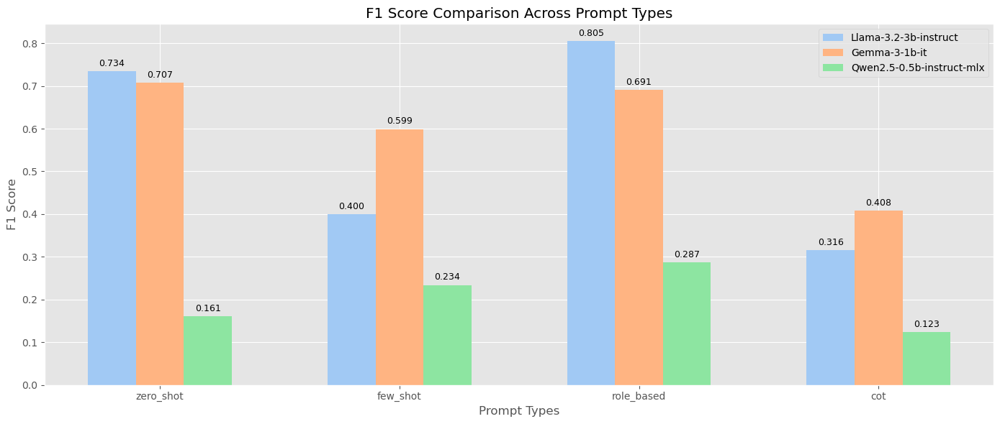
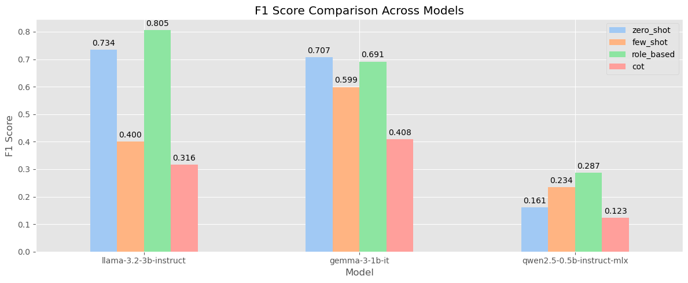
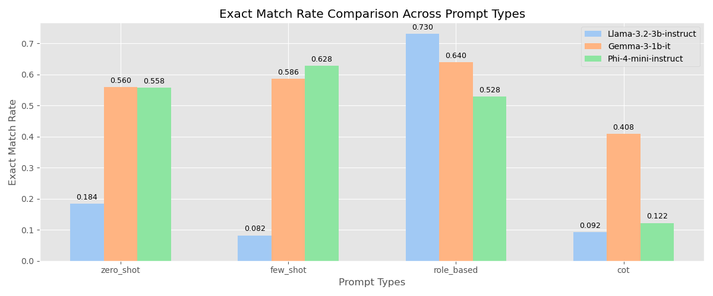
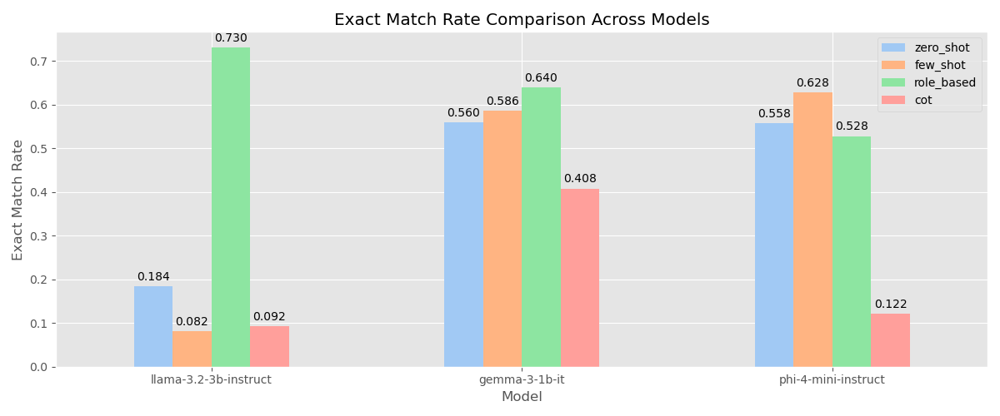
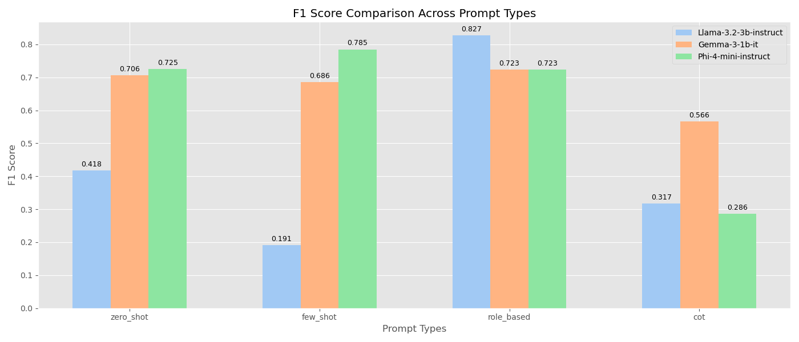
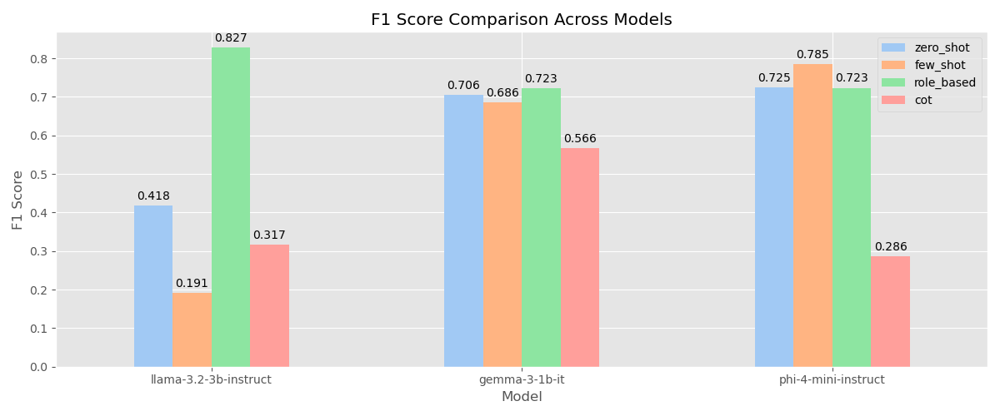
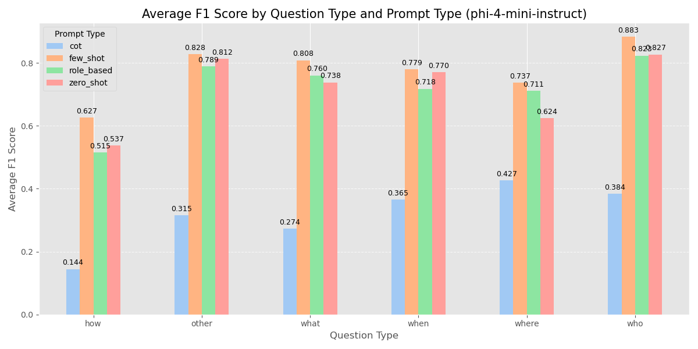

# Prompt Engineering for Question Answering (QA)

## 1. Introduction

This experiment evaluates prompt engineering strategies for Question Answering (QA) using the **SQuAD** dataset on three locally-hosted LLMs under resource constraints. Testing involved 500 samples from the SQuAD validation set using LMStudio API on a Mac with 8GB RAM, limiting model size and quantization(4 bit).

**Models Evaluated:**
- Llama-3.2-3b-instruct (3B parameters)
- Gemma-3-1b-it (1B parameters)
- Qwen2.5-0.5b-instruct-mlx (0.5B parameters)

## 2. Experimental Design

### 2.1 Prompting Strategies

Four prompting methods were compared:

- **Zero-shot**: Direct question-context input.
- **Few-shot**: Three representative QA examples provided before the main question.
- **Role-based**: Model assigned an "expert" persona.
- **Chain-of-Thought (CoT)**: Explicit reasoning instructions provided step-by-step.

### 2.2 Evaluation Metrics

- **Exact Match (EM)**: Measures exact textual match after normalization.
- **F1 Score**: Word-level precision and recall harmonized.

Normalization techniques included lowercasing and punctuation removal to standardize outputs.

## 3. Results and Discussion

### 3.1 Model and Prompt Performance

**Exact Match Rate:**

| Model                           | Zero-shot | Few-shot | Role-based | CoT   |
|---------------------------------|-----------|----------|------------|-------|
| Llama-3.2-3b-instruct (3B)      | 0.550     | 0.260    | 0.548      | 0.178 |
| Gemma-3-1b-it (1B)              | 0.590     | 0.456    | 0.606      | 0.198 |
| Qwen2.5-0.5b-instruct-mlx (0.5B)| 0.000     | 0.050    | 0.060      | 0.004 |

**F1 Score:**

| Model                           | Zero-shot | Few-shot | Role-based | CoT   |
|---------------------------------|-----------|----------|------------|-------|
| Llama-3.2-3b-instruct (3B)      | 0.734     | 0.400    | 0.805      | 0.316 |
| Gemma-3-1b-it (1B)              | 0.707     | 0.599    | 0.691      | 0.408 |
| Qwen2.5-0.5b-instruct-mlx (0.5B)| 0.161     | 0.234    | 0.287      | 0.123 |

### 3.2 Analysis and Insights

- **Model Capacity**: Larger models (Llama-3B, Gemma-1B) significantly outperform smaller models (Qwen-0.5B). Gemma performed particularly well in concise prompting methods.
- **Prompting Strategies**: Role-based prompting provided consistently strong performance with concise, accurate outputs. Zero-shot was unexpectedly effective, while Few-shot and CoT underperformed, likely due to formatting non-compliance and verbosity.
- **Output Control Challenges**: Explicit formatting instructions were frequently ignored, especially in Few-shot and CoT prompting, reducing EM scores.
- **Evaluation Limitations**: Despite normalization, extraneous outputs significantly impacted Exact Match scores, suggesting more robust normalization techniques are needed.
- **Resource Constraints**: Limited hardware restricted testing to quantized smaller models, affecting exploration of potentially more powerful larger models.

### 3.3 Prompt Bias and Mitigation

Analysis on Llama-3.2-3b-instruct revealed prompt-specific biases across question types. **Role-based** prompting consistently achieved the highest F1, especially for factual questions like *who* (0.864) and *where* (0.821). In contrast, **Few-shot** and **CoT** underperformed, particularly on *how* and *where* questions, due to output verbosity and formatting violations.

| Question Type | Best Prompt | F1 | Worst Prompt | F1 |
|---------------|-------------|----|---------------|----|
| who           | Role-based  | 0.864 | Few-shot    | 0.325 |
| where         | Role-based  | 0.821 | Few-shot    | 0.149 |
| how           | Role-based  | 0.718 | Few-shot    | 0.198 |
| what          | Role-based  | 0.774 | CoT         | 0.347 |
| when          | Role-based  | 0.819 | CoT         | 0.301 |
| other         | Role-based  | 0.895 | CoT         | 0.251 |

**Insights:**
- Prompt strategies interact differently with question types.
- Few-shot and CoT often produced excessive or misformatted outputs, harming EM and F1.
- Role-based prompts benefited from alignment with instruction-tuned model behavior.

**Mitigation:**
- Select prompt types adaptively based on question category.
- Improve Few-shot example design to ensure coverage and brevity.
- Enforce stricter formatting via decoding constraints or post-processing.
- Use per-type breakdowns to detect and mitigate bias during evaluation.

## 4. Conclusions

### 4.1 Model Selection

- Recommended for resource-limited setups: **Llama-3.2-3b-instruct** (3B).
- Adequate alternative: **Gemma-3-1b-it** (1B).
- Avoid models under 1B parameters.

### 4.2 Prompt Design

- **Role-based prompting** recommended for reliable outputs.
- Simple prompting (Zero-shot, Role-based) preferred over complex methods like CoT.
- Explicit formatting instructions necessary but may require improved enforcement methods.
- For Few-shot, carefully balance representativeness with token limits.

## 5. Updated Analysis with Modified Approach

Based on revised experiment with adjusted prompts, enhanced evaluation metrics, and the inclusion of phi-4-mini-instruct, we present the following updated findings:

### 5.1 Impact of Prompt Template Refinements

Our prompt template refinements focused on three key improvements:
- Clearer formatting instructions and answer expectations
- More structured few-shot examples with consistent formatting
- Simplified Chain-of-Thought (CoT) steps with explicit final answer formatting

**Exact Match Rate (Updated):**

| Model                   | Zero-shot | Few-shot | Role-based | CoT   |
|-------------------------|-----------|----------|------------|-------|
| Llama-3.2-3b-instruct   | 0.184     | 0.082    | 0.730      | 0.092 |
| Gemma-3-1b-it           | 0.560     | 0.586    | 0.640      | 0.408 |
| phi-4-mini-instruct     | 0.558     | 0.628    | 0.528      | 0.122 |

**F1 Score (Updated):**

| Model                   | Zero-shot | Few-shot | Role-based | CoT   |
|-------------------------|-----------|----------|------------|-------|
| Llama-3.2-3b-instruct   | 0.418     | 0.191    | 0.827      | 0.317 |
| Gemma-3-1b-it           | 0.706     | 0.686    | 0.723      | 0.566 |
| phi-4-mini-instruct     | 0.725     | 0.785    | 0.723      | 0.286 |

### 5.2 Comparative Analysis of Model Performance

The updated results reveal significant shifts in model performance:

1. **Llama-3.2-3b-instruct**: Shows remarkable improvement with role-based prompting (0.827 F1, 0.730 EM), but dramatic underperformance with other prompt types. This suggests high sensitivity to prompt formatting and clear instruction.

2. **Gemma-3-1b-it**: Demonstrates consistent performance across prompting strategies, with role-based (0.723 F1, 0.640 EM) and zero-shot (0.706 F1, 0.560 EM) showing strong results. This indicates greater robustness to prompt variations.

3. **phi-4-mini-instruct**: Exhibits strongest performance with few-shot prompting (0.785 F1, 0.628 EM), suggesting effective utilization of examples. Despite having fewer parameters than Llama-3B, it achieves competitive results, particularly in F1 score.

### 5.3 Revised Prompt Bias Analysis for phi-4-mini-instruct

Our examination of phi-4-mini-instruct reveals distinct question-type sensitivities:

| Question Type | Best Prompt | F1    | Worst Prompt | F1    |
|---------------|-------------|-------|--------------|-------|
| who           | few_shot    | 0.883 | cot          | 0.384 |
| what          | few_shot    | 0.808 | cot          | 0.274 |
| when          | few_shot    | 0.779 | cot          | 0.365 |
| where         | few_shot    | 0.737 | cot          | 0.427 |
| how           | few_shot    | 0.627 | cot          | 0.144 |
| other         | few_shot    | 0.828 | cot          | 0.315 |

**Key Insights**:
- phi-4-mini-instruct shows a strong preference for few-shot prompting across all question types
- Chain-of-Thought consistently underperforms despite simplified steps
- "Who" questions achieve the highest F1 scores (0.883 with few-shot)
- "How" questions remain the most challenging (0.627 with few-shot)

### 5.4 Impact of Improved Evaluation Metrics

The refined evaluation metrics based on the official SQuAD script show distinct improvements:

1. **Normalization Enhancements**: 
   - Removal of articles (a, an, the)
   - Punctuation standardization
   - Consistent whitespace handling

2. **Token-based Matching**:
   - More accurate identification of partial matches
   - Reduced sensitivity to word order variations

3. **Score Distribution**: 
   - Wider separation between effective and ineffective prompting strategies
   - More consistent ranking of models across metrics

## 6. Insights on Prompt Engineering for QA

### 6.1 Model Selection and Performance Patterns

1. **Parameter Count ≠ Universal Performance**: Larger models don't always outperform smaller ones across all prompting strategies.

2. **Model-Prompt Specificity**: Each model demonstrates distinct preferences for specific prompting strategies, suggesting architectural differences influence prompt sensitivity.

3. **Consistency vs. Peak Performance Trade-off**: Models exhibit either high peak performance with specific prompt types or consistent performance across all prompt types, but rarely both.

### 6.2 Effective Prompt Design Principles

1. **Explicit Persona Attribution**: Assigning expert roles consistently improves performance across model architectures by providing behavioral framing.

2. **Answer Format Specification**: Clear output formatting instructions significantly impact exact match scores, with concise, specific directives yielding better results.

3. **Cognitive Complexity Paradox**: Simpler prompting strategies often outperform more elaborate ones, with zero-shot frequently matching or exceeding few-shot performance.

4. **Question-Type Sensitivity**: Different question categories (who, what, when, where, how) respond differently to prompting strategies.

### 6.3 Implementation Tips

1. **Adaptive Prompting Framework**: Implement dynamic prompt selection based on question type and available computational resources.

2. **Prompt Calibration Period**: For any new model deployment, conduct systematic prompt testing to identify optimal strategies before full implementation.

3. **Hybrid Engineering Approach**: Combine prompt engineering with lightweight post-processing to normalize outputs and improve exact match scores.

4. **Parameter Efficiency Focus**: For resource-constrained environments, emphasize prompt optimization over model scaling.

5. **Evaluation Metric Alignment**: Ensure evaluation metrics match the intended use case, as F1 and exact match scores can lead to different conclusions about prompt effectiveness.

## 7. Future Work

- **Domain-Specific Evaluation**: Extend tests to domain-specific datasets to assess robustness and generalizability.
- **API Evaluation**: Compare local models against commercial API-hosted models to evaluate practical deployment trade-offs and identify performance benchmarks.

